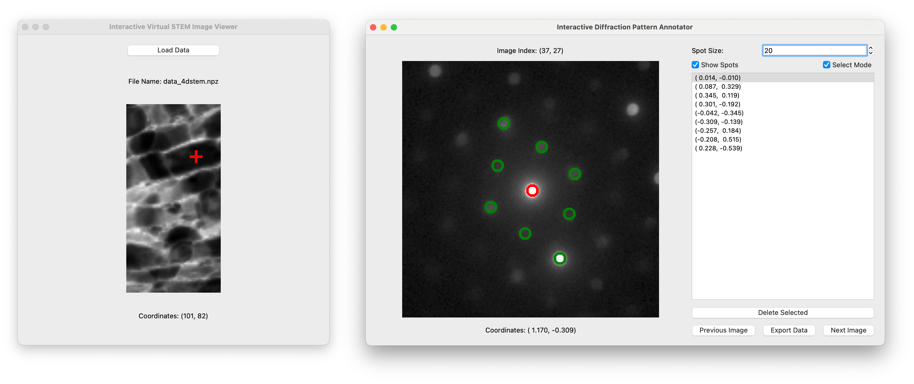
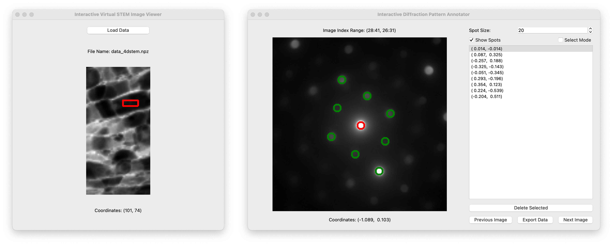

# cb_4dstem_annotator

This repository provides **an interactive annotation tool for 4D STEM (Scanning Transmission Electron Microscopy) data**. It is designed to faciliate the navigation, visualization, and annotation of complex 4D datasets. The tool would be useful for researchers and scientists in materials science, electron microscopy, and related fields where diffraction pattern analysis is required.

  
  
<strong>Screenshots of the Virtual STEM Image Viewer and Diffraction Pattern Annotator with a single scan point selected</strong>

  
  
<strong>Screenshots of the Virtual STEM Image Viewer and Diffraction Pattern Annotator with a rectangular region of scan points selected</strong>

